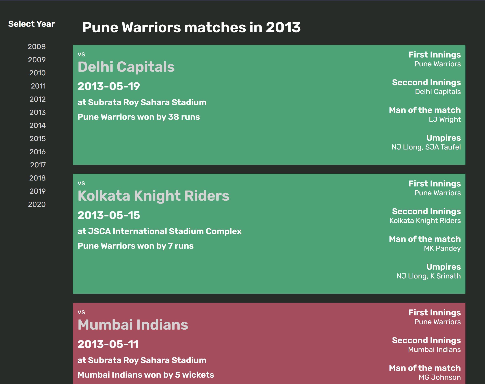

# IPL-Dashboard

A web application dashboard to view Indian Premier League (IPL) teams and match details, built with Spring Boot and React.

## Table of Contents

1. [Installation](#installation)
2. [Usage](#usage)
3. [Credits](#credits)
4. [Screenshots](#screenshots)
5. [Technologies Used](#technologies-used)
6. [API Reference](#api-reference)
7. [Contact](#contact)

## Installation

Ensure you have the following installed on your machine:

### Backend:
- **Java: Version 11**
- **Maven: Version 3.6** (or newer)
- **Spring Boot: Version 2.4.4**

### Frontend:
- **Node.js: Version 14** (or newer)
- **React: Version 18.2.0**

Instructions:
1. Navigate to the `frontend` directory.
2. Run `npm install` to install dependencies.
3. Run `npm run build` to build the frontend application. The build files will be copied to the Spring application directory.
4. Navigate back to the project root directory.
5. Run `mvn install` to install backend dependencies.
6. Run `mvn spring-boot:run` to start the Spring application.
7. Once the application is running, open your web browser and navigate to `http://localhost:8080` to access the IPL Dashboard.

### Deployment:
- The application is deployed on AWS. (Detailed deployment steps to be provided)

## Usage

The application serves as a dashboard for viewing IPL teams and matches. Users can navigate through different teams, view team details, and see match details for a specified year.

## Credits

This project was created following a tutorial series by Java Brains on YouTube.
- Channel: [Java Brains](https://www.youtube.com/@Java.Brains)
- Playlist: [IPL Dashboard - Spring Boot + React Full Stack development](https://www.youtube.com/playlist?list=PLqq-6Pq4lTTa8V613TZhGq4o8hSgkMGQ0)

## Screenshots

## Technologies Used

- **Backend**:
    - Java
    - Spring Boot
    - Spring Batch
    - Maven
    - HSQLDB

- **Frontend**:
    - React
    - Node.js

- **Deployment**:
    - AWS

## API Reference

- Backend API endpoints are exposed for fetching team and match data, as defined in the `TeamController` class.

## Contact

- Email: [hamidreza74hrr@yahoo.com](mailto:hamidreza74hrr@yahoo.com)
- LinkedIn: [Hamid Reza Rezaei](https://www.linkedin.com/in/hamid-reza-rezaei-17896a125/)

